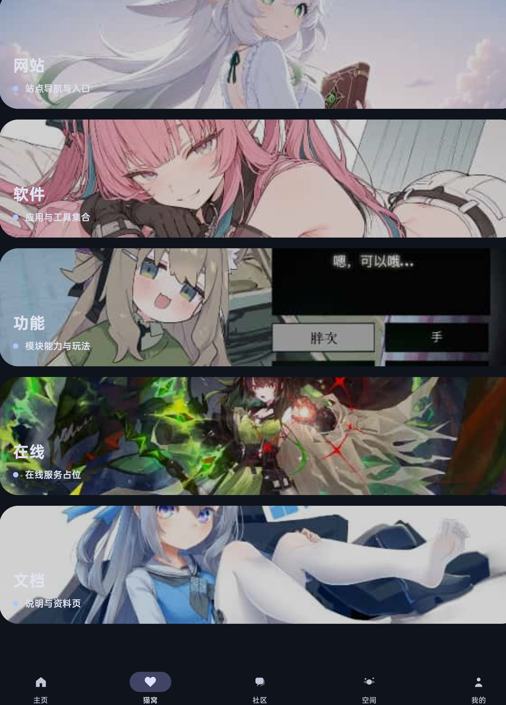

# Nekostar(开发中)  
//Android端:kotlin，c++ Windows端:c#,c++  
Android端遵循material3设计，windows端遵循winui3设计(？)  
一个纯vibe coding创建的应用，旨在简化娱乐资源获取，其具有以下功能  
去中心化社区(自行搭建服务器)  
文件管理  
内置浏览器  
模拟器  
ai agent (mobile use?)  
galgame聚合搜索(本地)  
特殊文件识别(enc文件识别，图/视频隐写识别)  
文件查看器  
综合收藏夹  
在线浏览  
云同步(自行搭建服务器)  
悬浮窗工具  
...  
该项目使用了以下项目源码  
[searchgal(galgame聚合搜索功能)](https://github.com/Moe-Sakura/SearchGal)  
[openlist(网盘直链解析)](https://github.com/OpenListTeam/OpenList)  
...  

